<a name="readme-top"></a>


<!--

[![Contributors][contributors-shield]][contributors-url]
[![Forks][forks-shield]][forks-url]
[![Stargazers][stars-shield]][stars-url]
[![Issues][issues-shield]][issues-url]
[![MIT License][license-shield]][license-url]
[![LinkedIn][linkedin-shield]][linkedin-url]

-->


<!-- PROJECT LOGO -->
<br />
<div align="center">

  <a href="https://github.com/OraclYT/mark-3-demo">
    
  </a> 


<h1 align="center">Saket Sweet</h1>

  <p align="center">
     Curtain Avenue : real client project for curtain stores.
    <br />
    <br />
    <br />    ·
     <!--
    <a href="https://github.com/github_username/repo_name/issues">Report Bug</a>
    ·
    <a href="https://github.com/github_username/repo_name/issues">Request Feature</a>
     -->
  </p>
</div>

<!-- ABOUT THE PROJECT -->
## About The Project

<a href="https://github.com/OraclYT/mark-3-demo">
    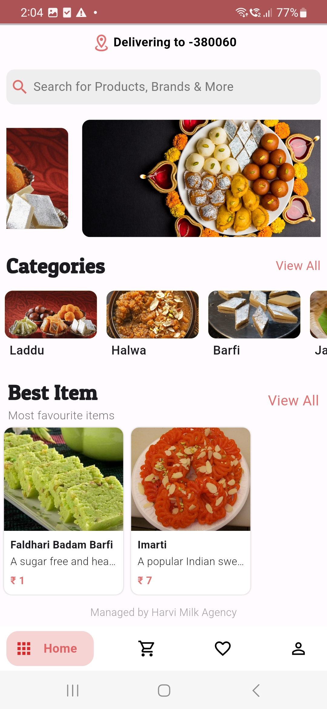
  </a> 
  <a href="https://github.com/OraclYT/mark-3-demo">
    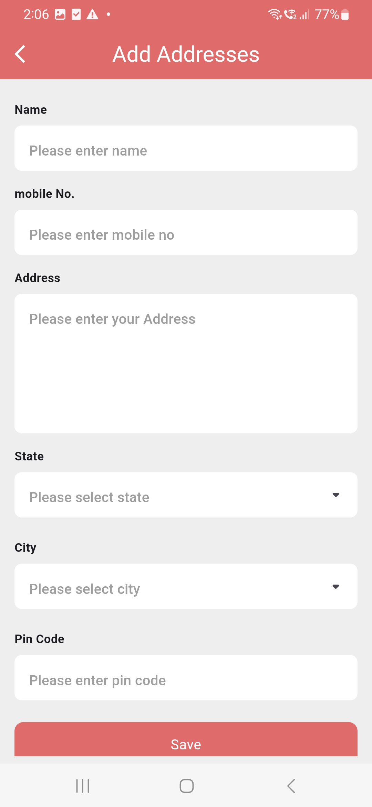
  </a> 
  <a href="https://github.com/OraclYT/mark-3-demo">
    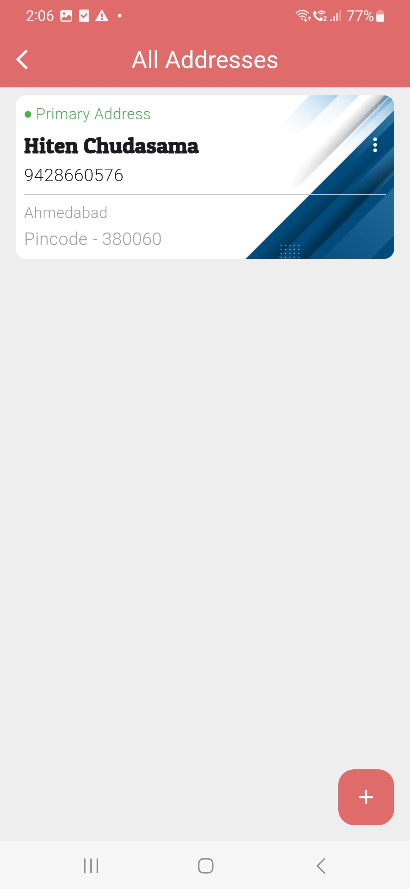
  </a>
  <a href="https://github.com/OraclYT/mark-3-demo">
    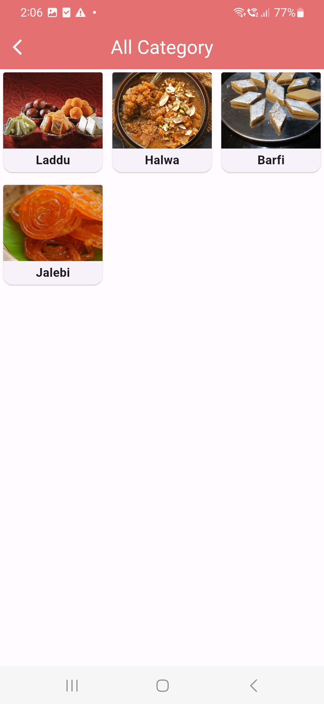
  </a>
  <a href="https://github.com/OraclYT/mark-3-demo">
    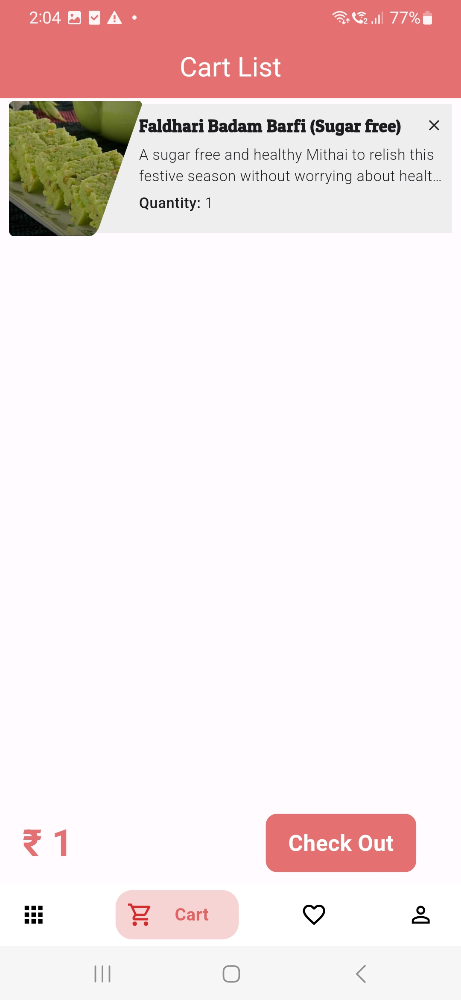
  </a> 
  <a href="https://github.com/OraclYT/mark-3-demo">
    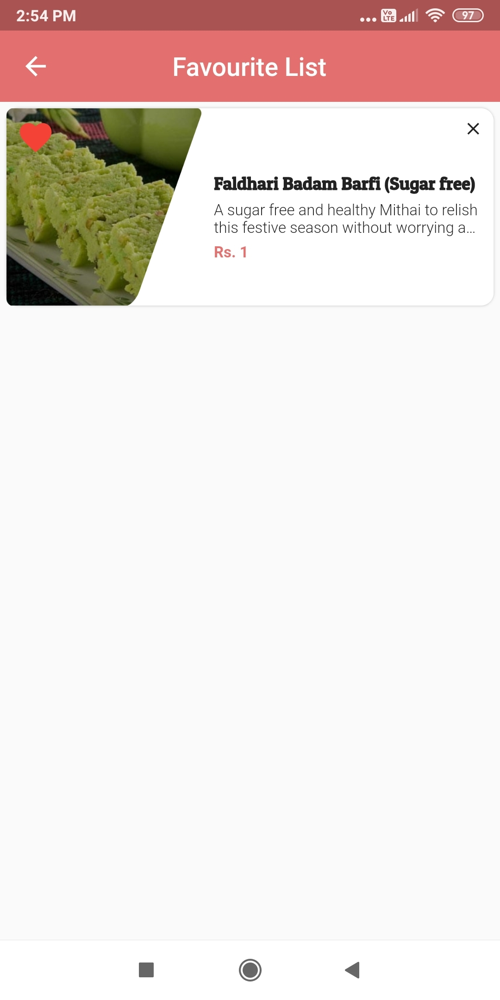
  </a> 
  <a href="https://github.com/OraclYT/mark-3-demo">
    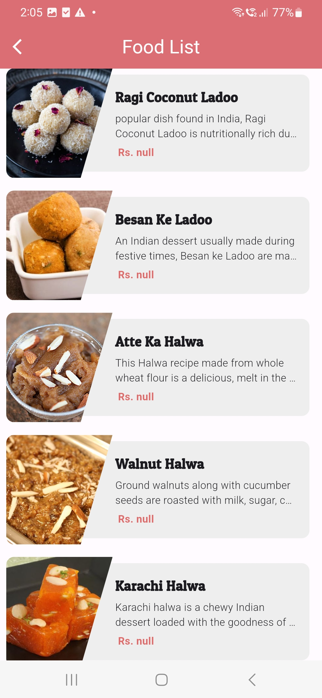
  </a>
  <a href="https://github.com/OraclYT/mark-3-demo">
    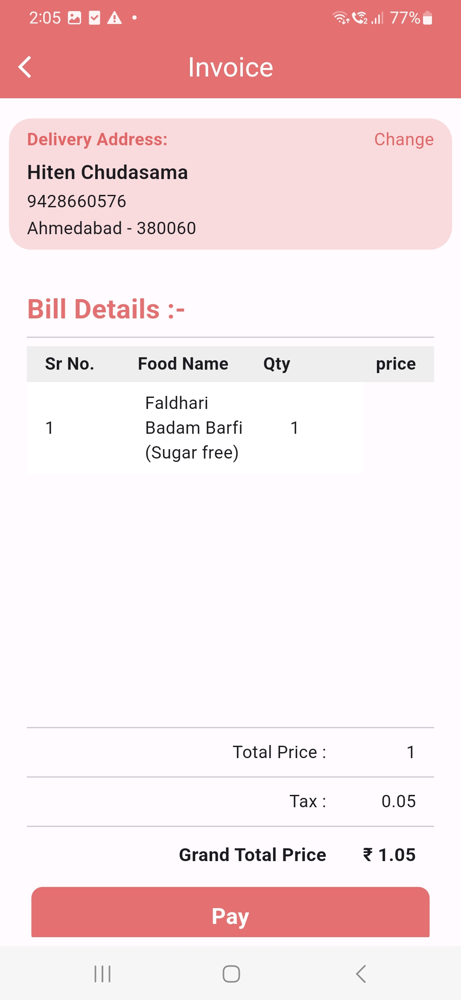
  </a>
   <a href="https://github.com/OraclYT/mark-3-demo">
    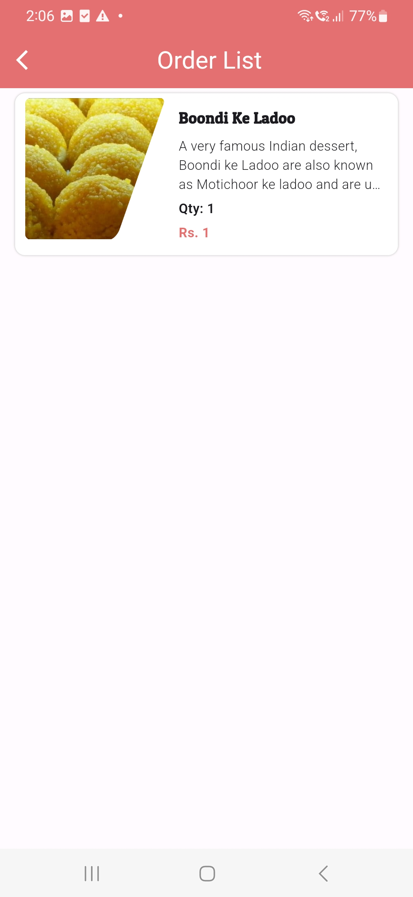
  </a>
   <a href="https://github.com/OraclYT/mark-3-demo">
    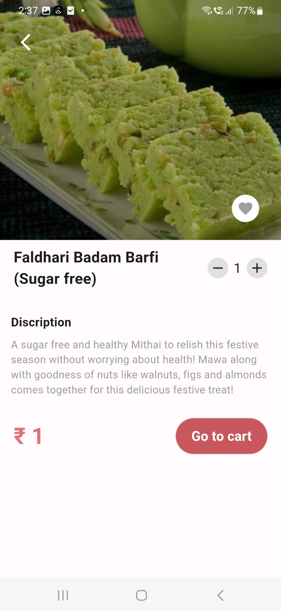
  </a>
   <a href="https://github.com/OraclYT/mark-3-demo">
    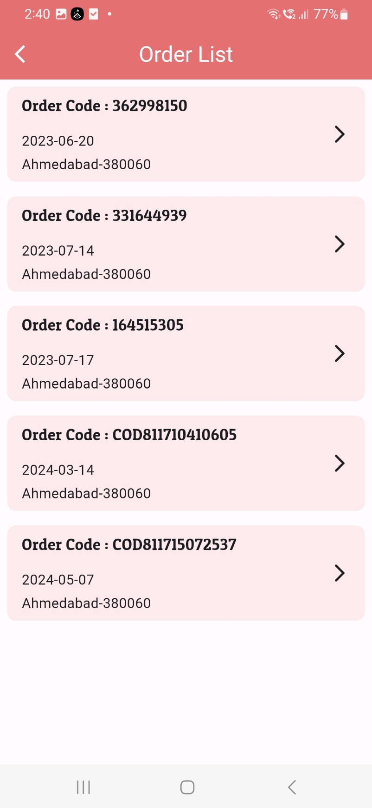
  </a>
   <a href="https://github.com/OraclYT/mark-3-demo">
    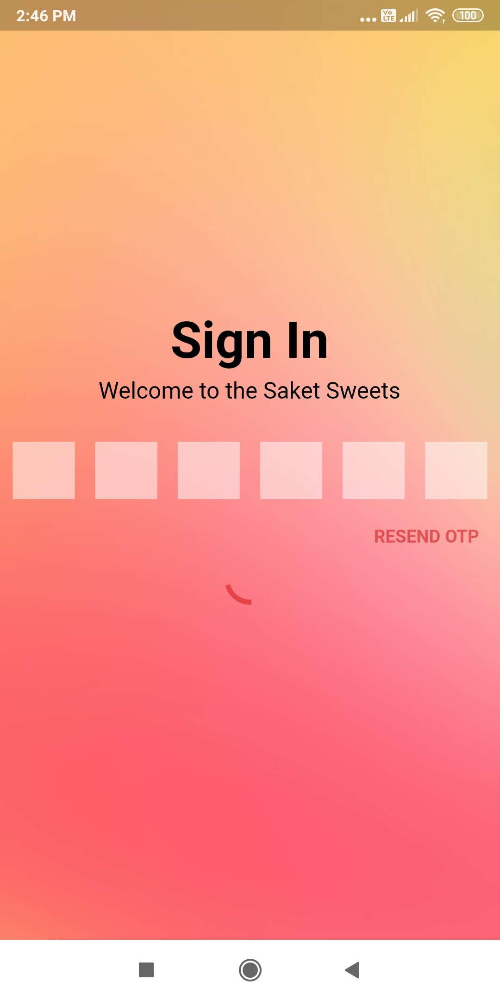
  </a>
   <a href="https://github.com/OraclYT/mark-3-demo">
    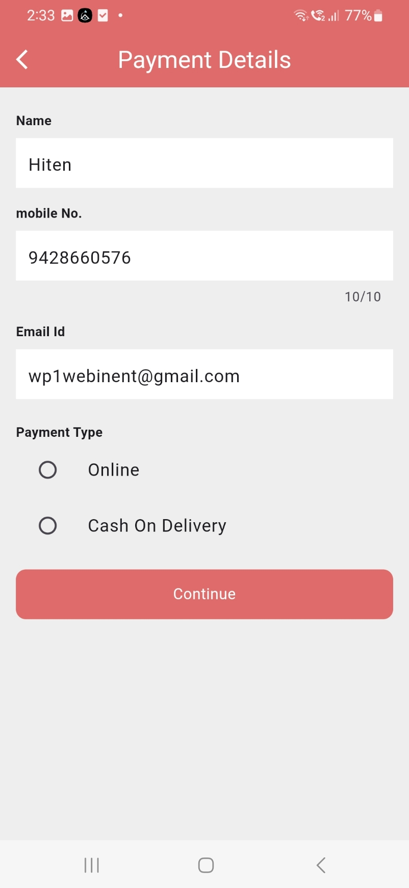
  </a>
   <a href="https://github.com/OraclYT/mark-3-demo">
    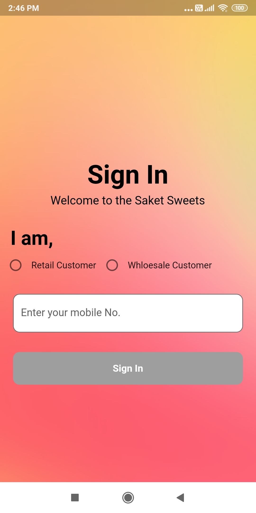
  </a>
   <a href="https://github.com/OraclYT/mark-3-demo">
    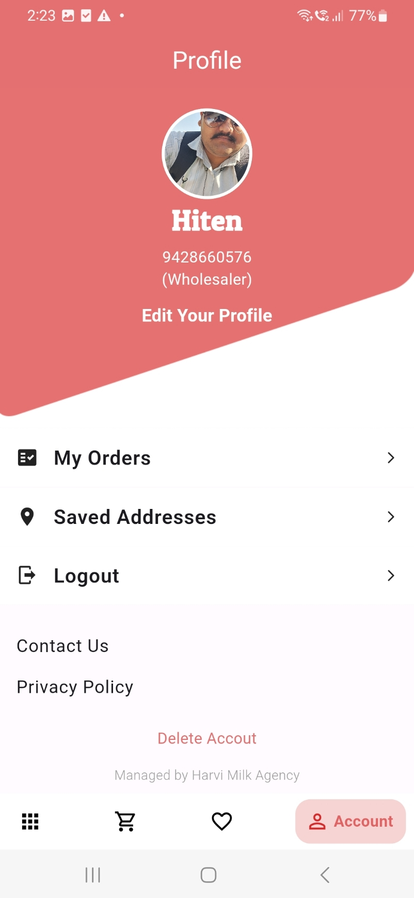
  </a>
   <a href="https://github.com/OraclYT/mark-3-demo">
    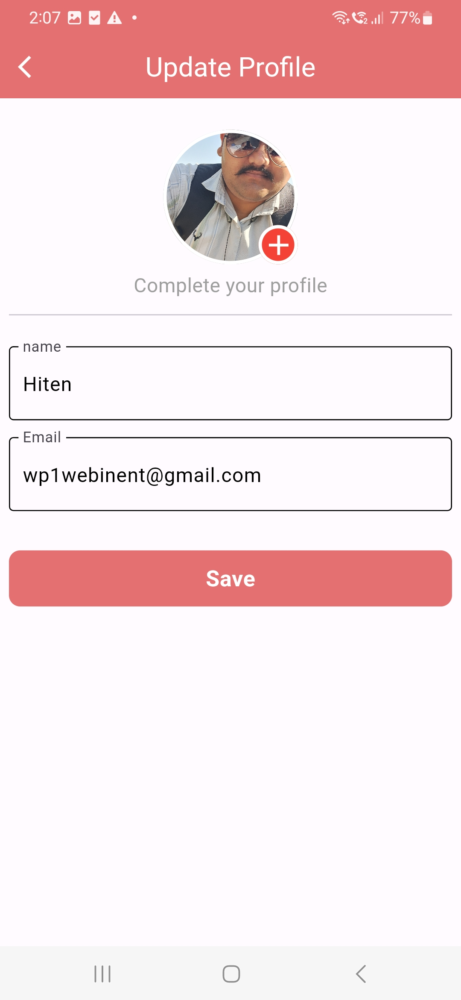
  </a>
   <a href="https://github.com/OraclYT/mark-3-demo">
    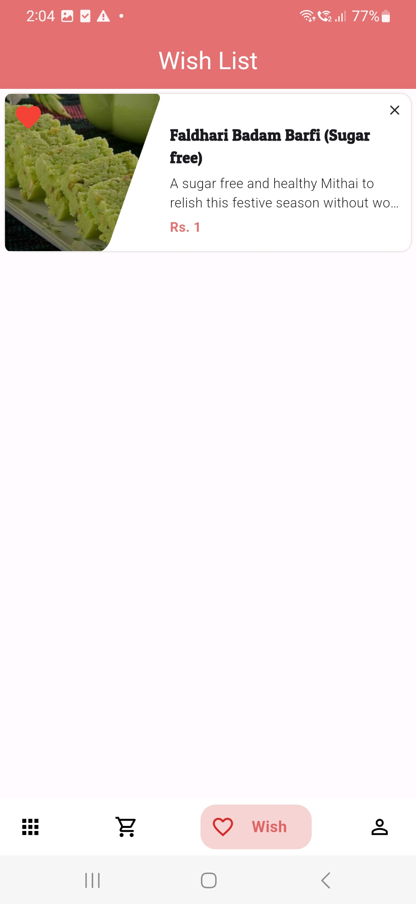
  </a>

<p align="right">(<a href="#readme-top">back to top</a>)</p>


### Built With

[![flutter][flutter.js]][Next-url]<br>
[](https://laravel.com/)<br>
[](Next-url)
<!--
* [![React][React.js]][React-url]
* [![Vue][Vue.js]][Vue-url]
* [![Angular][Angular.io]][Angular-url]
* [![Svelte][Svelte.dev]][Svelte-url]
* [![Laravel][Laravel.com]][Laravel-url]
* [![Bootstrap][Bootstrap.com]][Bootstrap-url]
* [![JQuery][JQuery.com]][JQuery-url]
-->
<p align="right">(<a href="#readme-top">back to top</a>)</p>


<!-- GETTING STARTED -->
## Getting Started

Saket Sweet is a delightful Flutter-based mobile application crafted to provide users with a sweet journey into the world of coding. In this app, users will embark on an enchanting adventure through a virtual city, guiding a character through a series of engaging challenges.

Curtain Avenue is a groundbreaking mobile application developed using Flutter, aiming to initiate users into the realm of coding through an immersive interactive experience. Within this app, users embark on an exciting journey, navigating a virtual city while guiding a character through a series of stimulating challenges.

## Core Concept

At the heart of Curtain Avenue lies a revolutionary block-based programming system, designed to streamline the planning of the character's path. Departing from conventional lines of code, users employ an intuitive drag-and-drop interface, utilizing visual blocks of statements to craft intricate routes. This approach fosters accessibility and engagement, particularly for novice coders, by presenting coding concepts in a user-friendly and interactive format.

### Features

1. `All Categories`: Explore a wide array of curtain categories tailored to suit every taste and preference. From elegant drapes to vibrant prints, users can browse through various categories to discover the perfect curtains for their space.

2. `Cart List`: Seamlessly manage your shopping cart with the Cart List feature. Add desired curtains to your cart, review selected items, and modify quantities as needed. With a user-friendly interface, the Cart List ensures a hassle-free shopping experience.

3. `Favorite List`: Create a personalized collection of favorite curtains with the Favorite List feature. Mark curtains as favorites to easily revisit and compare them later, streamlining the decision-making process and enhancing user convenience.

4. `Profile`: Access your personalized profile to view and manage account details. Update personal information, track order history, and manage preferences with ease. The Profile feature offers a seamless and customizable user experience tailored to individual needs.
 
5. `Invoice`: Stay organized and informed with detailed invoices for each purchase. Access comprehensive invoices containing itemized lists, prices, and order summaries to track expenses and facilitate record-keeping.

6. `Order Details`:  Gain insights into order status and progress with the Order Details feature. View detailed information about current and past orders, including order dates, item details, and delivery status. Stay updated on the status of your purchases to ensure a smooth and timely shopping experience.

7. `Add Address`: Streamline the checkout process by adding and managing delivery addresses with ease. The Add Address feature allows users to store multiple addresses for convenient shipping options and ensures accurate and efficient delivery of orders.

8. `Payment Method`: Choose from a variety of secure payment methods to complete your purchases seamlessly. Whether it's credit/debit cards, digital wallets, or other payment options, the Payment Method feature offers flexibility and convenience for hassle-free transactions.
<!--
### Installation

1. Get a free API Key at [https://example.com](https://example.com)
2. Clone the repo
   ```sh
   git clone https://github.com/github_username/repo_name.git
   ```
3. Install NPM packages
   ```sh
   npm install
   ```
4. Enter your API in `config.js`
   ```js
   const API_KEY = 'ENTER YOUR API';
   ```
-->
<p align="right">(<a href="#readme-top">back to top</a>)</p>


## Educational Benefit

- `Introduction to Coding Concepts`: Saket Sweet introduces users to fundamental e-commerce concepts such as product browsing, cart management, and secure transactions. Through intuitive interfaces and interactive features, users gain hands-on experience in navigating digital marketplaces.
  
- `Enhanced Logical Thinking`: Users are challenged to make informed decisions while exploring various curtain categories, managing their cart, and selecting payment methods. This fosters the development of decision-making skills and encourages thoughtful consideration of options.
  
- `Financial Literacy Development`: The application promotes financial literacy by allowing users to manage their budgets, track expenses, and understand the financial implications of their purchasing decisions. This hands-on approach to financial management fosters responsible spending habits and financial awareness.
  
- `Personalized Shopping Experience`: Saket Sweet tailors the shopping experience to each user's preferences and needs, providing personalized recommendations based on browsing history and favorite items. This customization encourages users to explore new products while fostering a sense of ownership over their shopping journey.
  
- `Problem-Solving Enhancement`: Users can enhance their problem-solving skills by resolving issues related to order management, address validation, and payment processing within the application. This hands-on approach to problem-solving encourages users to tackle challenges with creativity and resilience.

## Future Enhancements:
Interactive Learning Modules: Integrate interactive learning modules within the app to provide users with educational resources on e-commerce best practices, online security, and consumer rights, enhancing their understanding of digital commerce.

Gamified Learning Challenges: Implement gamified learning challenges that simulate real-world e-commerce scenarios, allowing users to apply their knowledge and skills in a fun and engaging way while earning rewards and achievements.

Community Learning Forums: Establish community learning forums where users can share tips, insights, and success stories related to online shopping and financial management. This collaborative environment encourages peer-to-peer learning and knowledge sharing.

Financial Planning Tools: Introduce financial planning tools within the app to help users set budget goals, track spending habits, and plan for future purchases. These tools provide users with practical tools for financial management and goal setting.

E-Commerce Skills Certification: Offer e-commerce skills certification programs within the app, allowing users to demonstrate their proficiency in online shopping, financial management, and digital commerce. Certification programs provide users with tangible credentials to showcase their skills and knowledge in the marketplace.

## Target Audience

Budget-Conscious Shoppers: Savvy consumers who prioritize value and affordability, benefiting from features such as budget tracking tools and promotional offers.

Tech-Savvy Consumers: Users interested in leveraging technology to streamline their shopping journey, exploring innovative features like virtual room visualization and real-time order tracking.

Busy Professionals: On-the-go individuals who value convenience and efficiency in their shopping experience, appreciating features such as personalized recommendations and secure payment methods.

Interior Design Enthusiasts: Design professionals and enthusiasts seeking inspiration and access to a wide range of curtain options to complement their interior design projects.

<p align="right">(<a href="#readme-top">back to top</a>)</p>


<!-- CONTACT -->
## Contact

Prakash Patel - [@linkedin](https://www.linkedin.com/in/prakash-patell/) - patelprakash8087@gmail.com


### !NO SOURCE CODE(CAN BE USED BY OTHERS IF DECLARED)

<p align="right">(<a href="#readme-top">back to top</a>)</p>


<!-- MARKDOWN LINKS & IMAGES -->
<!-- https://www.markdownguide.org/basic-syntax/#reference-style-links -->
[contributors-shield]: https://img.shields.io/github/contributors/github_username/repo_name.svg?style=for-the-badge
[contributors-url]: https://github.com/github_username/repo_name/graphs/contributors
[forks-shield]: https://img.shields.io/github/forks/github_username/repo_name.svg?style=for-the-badge
[forks-url]: https://github.com/github_username/repo_name/network/members
[stars-shield]: https://img.shields.io/github/stars/github_username/repo_name.svg?style=for-the-badge
[stars-url]: https://github.com/github_username/repo_name/stargazers
[issues-shield]: https://img.shields.io/github/issues/github_username/repo_name.svg?style=for-the-badge
[issues-url]: https://github.com/github_username/repo_name/issues
[license-shield]: https://img.shields.io/github/license/github_username/repo_name.svg?style=for-the-badge
[license-url]: https://github.com/github_username/repo_name/blob/master/LICENSE.txt
[linkedin-shield]: https://img.shields.io/badge/-LinkedIn-black.svg?style=for-the-badge&logo=linkedin&colorB=555
[linkedin-url]: https://linkedin.com/in/linkedin_username
[product-screenshot]: images/ss1.png
[product-screenshot-2]: images/ss2.png
[flutter.js]: https://img.shields.io/badge/flutter-20232A?style=for-the-badge&logo=flutter&logoColor=61DAFB
[unity.js]: https://img.shields.io/badge/unity%203D-000000?style=for-the-badge&logo=unity&logoColor=white
[Next-url]: https://nextjs.org/
[React.js]: https://img.shields.io/badge/React-20232A?style=for-the-badge&logo=react&logoColor=61DAFB
[React-url]: https://reactjs.org/
[Vue.js]: https://img.shields.io/badge/Vue.js-35495E?style=for-the-badge&logo=vuedotjs&logoColor=4FC08D
[C.js]: https://img.shields.io/badge/c%20sharp-000000?style=for-the-badge&logo=c&logoColor=4FC08D
[Vue-url]: https://vuejs.org/
[Angular.io]: https://img.shields.io/badge/Angular-DD0031?style=for-the-badge&logo=angular&logoColor=white
[Angular-url]: https://angular.io/
[Svelte.dev]: https://img.shields.io/badge/Svelte-4A4A55?style=for-the-badge&logo=svelte&logoColor=FF3E00
[Svelte-url]: https://svelte.dev/
[Laravel.com]: https://img.shields.io/badge/Laravel-FF2D20?style=for-the-badge&logo=laravel&logoColor=white
[Laravel-url]: https://laravel.com
[Bootstrap.com]: https://img.shields.io/badge/Bootstrap-563D7C?style=for-the-badge&logo=bootstrap&logoColor=white
[Bootstrap-url]: https://getbootstrap.com
[JQuery.com]: https://img.shields.io/badge/jQuery-0769AD?style=for-the-badge&logo=jquery&logoColor=white
[JQuery-url]: https://jquery.com 
